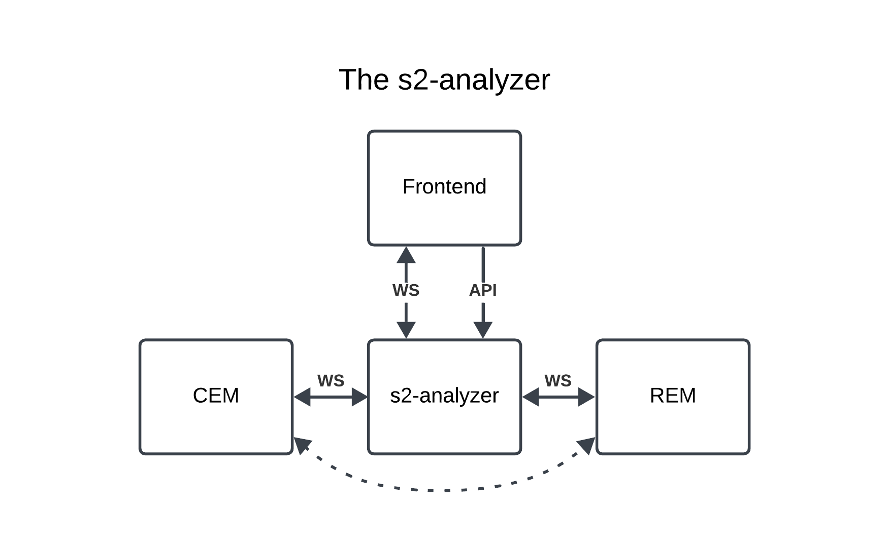

# S2 analyzer backend



## Goal

The backend of the s2 analyzer is tasked with processing, forwarding and validating all messages between the S2 resource manager (RM) and the customer energy manager (CEM). To use this backend, the RM and CEM connect with the S2 analyzer instead of connecting directly with each other. The result is that 2 websocket connections are created:
  1. From RM to S2 analyzer
  2. From CEM to S2 analyzer

In the current version of the S2 analyzer, it is up to the RM and CEM to initiate the websocket connection. In future versions, the S2 analyzer may be configured to initiate the connection to a listening RM and/or CEM as well.

It is possible to connect a number of RM's and CEM's to the S2 analyzer so that many S2 conversations are analyzed by the S2 analyzer simultaneously.

After the connections have been set up, the S2 analyzer provides a number of functionalities. The S2 analyzer will:
- Forward any message from the RM to the CEM connection and vice versa
- Store the messages in a message history SQLite database
- Validate the format of the s2 messages using the S2 python package. Validation errors are stored in the message history database.

- Provide a websocket connection for debugging purposes. The frontend can connect to this websocket to see all messages in transit along with any validation errors.
- Provide a REST API for the frontend to query the message history database.
- Provides a REST API endpoint for injecting messages into a connection between a CEM and RM device.

## Features of backend and frontend

Please consult the README files in the backend and frontend directories for more information on the features of the backend and frontend.

## Quickstart using docker and docker-compose

To quickly set up & run the S2 analyzer:
```bash
docker-compose up --build
```

This will build the backend and also the frontend to container images locally and run them.

The backend is available on port `8001`.
The frontend is available on port `4173`.

## Quickstart without containers
Python 3.10 is required. Steps to set up & run the S2 analyzer backend locally:
```bash
cd ./backend/
python3.10 -m venv ./.venv/
. ./.venv/bin/activate
pip3 install -r ./requirements.txt
LOG_LEVEL=info python3 -m s2_analyzer_backend.main --s2-json-schemas-dir ./s2-ws-json/s2-json-schema/
```
