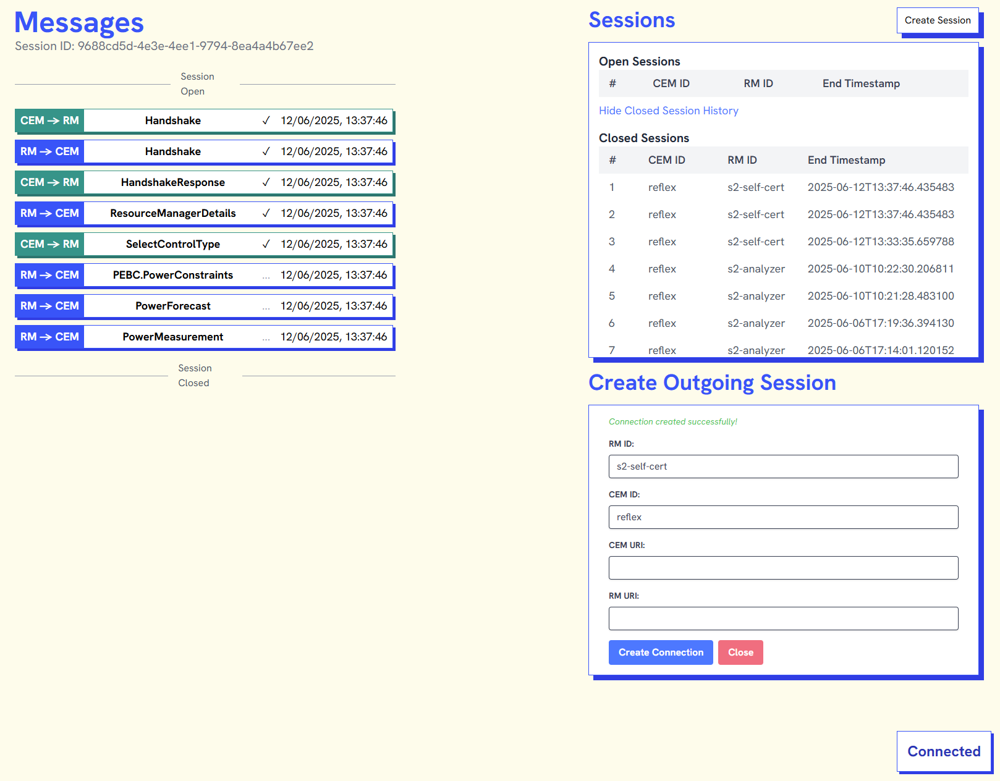

# S2 analyzer backend

<div align="center">
    <a href="https://s2standard.org"></a>
</div>
<br />

This repository hosts the S2 Analyzer, a tool to visualise and check what's happening on an S2 connection. It sits between the RM and CEM: the RM and CEM connect to the S2 Analyzer, and it'll forward the messages to the other side while validating the messages and sending them to the frontend to visualise.

## Quickstart using docker and docker-compose

To quickly set up & run the S2 analyzer:
```bash
docker compose up
```

You can reach the frontend at `localhost:8000`. Connect your Resource Manager to `"ws://localhost:8001/backend/rm/battery1/cem/cem1/ws"` and connect your CEM to `ws://localhost:8001/backend/cem/cem1/rm/battery1/ws`, and you'll see the messages flowing between them in the frontend. If you don't have an RM, you can use one of the [example RM implementations](https://github.com/flexiblepower/s2-example-implementations) to test your CEM.

## Goal

The backend of the s2 analyzer is tasked with processing, forwarding and validating all messages between the S2 resource manager (RM) and the customer energy manager (CEM). To use this backend, the RM and CEM connect with the S2 analyzer instead of connecting directly with each other. The result is that 2 websocket connections are created:
  1. From RM to S2 analyzer
  2. From CEM to S2 analyzer

This connection can be initiated in 3 ways:
 1. The devices connect to the S2 Analyzer, specifying their role and the id of the other device in the URI
 2. The S2 Analyzer initiates the connection to the devices (using the form in the frontend)
 3. A combination of 1 and 2 (As long as the IDs match)

It is possible to connect a number of RM's and CEM's to the S2 analyzer so that many S2 conversations are analyzed by the S2 analyzer simultaneously. You can switch between different sessions using the session selector on the frontend. This can also be used to look at old 

After the connections have been set up, the S2 analyzer provides a number of functionalities. The S2 analyzer will:
- Forward any message from the RM to the CEM connection and vice versa
- Store the messages in a message history SQLite database (grouped by session)
- Validate the format of the s2 messages using the S2 python package. Validation errors are stored in the message history database.

- Provide a websocket connection for debugging purposes. The frontend can connect to this websocket to see all messages in transit along with any validation errors. By providing a query parameter on the websocket url you can filter the messages by session.
- Provide a REST API for the frontend to query the message history database. (To be implemented on frontend.)
- Provides a REST API endpoint for injecting messages into a connection between a CEM and RM device. (To be implemented on backend.)


Frontend:



## Features of backend and frontend

Please consult the README files in the backend and frontend directories for more information on the features of the backend and frontend.

## Quickstart without containers
Python 3.10 is required. Steps to set up & run the S2 analyzer backend locally:
```bash
cd ./backend/
python3.10 -m venv ./.venv/
. ./.venv/bin/activate
pip3 install -r ./requirements.txt
LOG_LEVEL=info python3 -m s2_analyzer_backend.main --s2-json-schemas-dir ./s2-ws-json/s2-json-schema/
```
